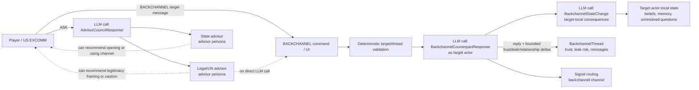
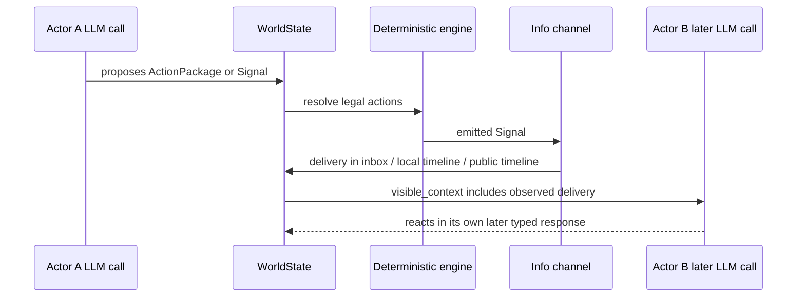

# LLM Agent Flow

This project does not run a swarm of agents that chat freely with each other.
It runs one game session with one LLM client, and the orchestrator asks that
client for typed JSON answers at specific points in the turn.

The short version:

```text
GameSession
  owns one LLMClient
  owns one TurnOrchestrator

TurnOrchestrator.run_turn()
  delivers old signals
  optionally asks advisors
  compiles player intent
  asks NPC faction agents
  resolves actions deterministically
  routes emitted signals
  asks event creator
  resolves scenario events
  updates backchannels, advisors, endings, and aftermath
```

## Mermaid Diagrams

### Surface Actors vs LLM Calls

This is the important split: surface actors are game fiction; LLM calls are the
actual model invocations.

```mermaid
flowchart LR
    Player["Player / US EXCOMM"]
    World["WorldState<br/>timelines, inboxes, advisors,<br/>backchannel threads"]

    subgraph AdvisorCall["LLM call: dialogue.us_excomm.advisor_response"]
        State["State advisor"]
        Defense["Defense advisor"]
        Intel["Intelligence advisor"]
        Political["Political advisor"]
        Legal["Legal/UN advisor"]
    end

    subgraph PlayerActionCall["LLM call: gamemaster.us_excomm.intent_compilation"]
        GM["Catalog gamemaster<br/>turns player text into ActionPackage(s)"]
    end

    subgraph FactionCalls["One LLM call per NPC faction"]
        Soviet["faction.soviet_presidium.turn"]
        Cuba["faction.cuba.turn"]
        NATO["faction.nato_allies.turn"]
    end

    subgraph ExternalCalls["Other LLM calls"]
        International["international.international.pressure"]
        EventCreator["event_creator.event_creator.media_event_turn"]
        Distortion["optional info_channel.signal.distortion"]
    end

    Player -->|"ASK"| AdvisorCall
    AdvisorCall -->|"advice, risks, suggested moves"| Player
    AdvisorCall -->|"small proposed advisor deltas"| World

    Player -->|"PLAN / ACTION / COMMIT"| PlayerActionCall
    PlayerActionCall -->|"ActionPackage(s)"| World

    World -->|"visible context"| FactionCalls
    FactionCalls -->|"NPC ActionPackage(s)"| World

    World -->|"public context"| International
    International -->|"pressure Signal(s)"| World

    World -->|"public context"| EventCreator
    EventCreator -->|"public brief / event candidate"| World

    World -->|"noisy signal only"| Distortion
    Distortion -->|"observed wording"| World
```



### Advisors And Backchannels



### What Counts As Communication

Surface actors "hear" each other only after code writes something into world
state that a later LLM call can see.



## Model Instances

There is normally one live model connection per `GameSession`.

- `GameSession.__init__()` creates `self.llm_client`.
- If no client is injected, it calls `_build_live_llm_client()`.
- `_build_live_llm_client()` returns `LlamaCppServerClient(load_settings().llama_cpp)`.
- `LlamaCppServerClient` talks to the OpenAI-compatible llama.cpp
  `/chat/completions` endpoint.
- Every live agent task uses that same client unless a test or caller injects a
  different `LLMClient`.

The main client implementations are:

| Client | Used for | Notes |
| --- | --- | --- |
| `LlamaCppServerClient` | real gameplay | Starts or calls llama.cpp, asks for JSON, validates with Pydantic. |
| `ScriptedLLMClient` | deterministic local/debug paths and many tests | Returns hand-coded responses by response schema. |
| `FakeLLMClient` | tests | Returns fixture responses by exact request label. |

The configured default live model is in `LlamaCppSettings`:

```text
preset: qwen3.5-35b-uncensored
server_model: Qwen3.5-35B-A3B-Q3_K_M
base_url: http://127.0.0.1:8080/v1
```

Machine-specific overrides come from `config/llama_cpp.local.json` or
`CRISIS_ROOM_LLAMACPP_*` environment variables.

## Agent Object Instances

There can be several Python agent objects, but they are not separate loaded
models.

- `GameSession` owns one `DialogueEngineAgent` for out-of-turn `ASK` calls.
- `TurnOrchestrator` owns its own `DialogueEngineAgent`,
  `CatalogGamemasterCompiler`, `PrototypeInfoChannel`, deterministic engine,
  and `EventCreatorAgent`.
- `FactionAgent` objects are constructed per NPC faction during each turn.
- `InternationalCommunityAgent` is constructed for the international actor
  during each turn.

Those wrappers all use the same `LLMClient` for live gameplay.

## What An Agent Is Here

An "agent" is mostly a thin wrapper around:

1. a visible-context builder,
2. a prompt,
3. a typed response schema,
4. some code that turns the response into game objects.

Agents do not directly call each other. They communicate through:

- returned Python objects,
- `ActionPackage` objects submitted to the deterministic engine,
- `Signal` objects routed through the info channel,
- persistent world state such as inboxes, timelines, backchannel threads, and
  advisor state.

## The Normal Turn

`TurnOrchestrator.run_turn()` is the spine.

1. `PrototypeInfoChannel.route_signals(world_state, [])`
   delivers pending signals whose arrival turn has come.

2. `build_turn_briefing()`
   builds player-facing problems, pressure, resources, and action cards.
   This is deterministic presentation code, not an LLM call.

3. Optional advisor dialogue:
   if `player_message` is non-empty, `DialogueEngineAgent.respond_to_player()`
   asks for `AdvisorCouncilResponse`.

4. Player action compilation:
   `CatalogGamemasterCompiler.compile_player_intent()` asks for
   `MultiIntentCompilation`, then validates and packages candidates as
   `ActionPackage` objects.

5. NPC entity turns:
   `_run_entity_agents()` loops over non-player actors.
   `opposing_faction` and `allied_faction` use `FactionAgent`.
   `international_community` uses `InternationalCommunityAgent`.

6. Batch validation:
   `build_batch_validation_report()` reports warnings such as action budget or
   channel conflicts.

7. Deterministic resolution:
   `DeterministicEngineV2.resolve_actions()` validates actions, changes
   resources/metrics/clocks/relationships, writes omniscient timeline entries,
   and emits `Signal` objects.

8. Formal backchannel responses:
   `build_formal_backchannel_response_signals()` adds response signals for
   formal direct backchannel actions.

9. Final routing:
   `PrototypeInfoChannel.route_signals()` delivers action signals, NPC signals,
   and formal backchannel response signals. It may delay, suppress, distort,
   contradict, or leak them.

10. Scenario pressure:
    `apply_scenario_pressure()` applies authored pressure rules and hidden
    obligations to the routed world.

11. Event creator:
    `EventCreatorAgent.create_candidate()` asks for `EventCreatorResponse`.
    It always writes a public brief and may suggest an event candidate.

12. Scenario events:
    `resolve_scenario_events()` deterministically decides whether authored
    events fire. Fired events may emit more signals, which are routed too.

13. Leak-triggered events:
    scenario events that depend on leaked action/capability ids get a second
    check after routing.

14. Cleanup and persistent updates:
    the orchestrator records an actor-local `No Visible Player Move` observation
    for factions that received no player signal. Then
    `update_event_choices_from_actions()`, `update_backchannel_threads()`,
    `update_advisor_council()`, ending evaluation, and aftermath presentation
    run before the turn number increments.

## LLM Tasks

These are the current typed LLM tasks. "Label shape" is what shows up in debug
records.

| Code | Label shape | Response schema | Purpose |
| --- | --- | --- | --- |
| `DialogueEngineAgent` | `dialogue.<player>.advisor_response` | `AdvisorCouncilResponse` | Answer player questions as the advisor council. Suggest moves; does not execute them. |
| `CatalogGamemasterCompiler` | `gamemaster.<actor>.intent_compilation` | `MultiIntentCompilation` | Turn player free text into candidate catalog actions. |
| `FactionAgent` | `faction.<entity>.turn` | `FactionTurnResponse` | For each NPC faction, perceive, debate, and choose one catalog action or no action. |
| `InternationalCommunityAgent` | `international.<entity>.pressure` | `InternationalPressure` | Produce outside legitimacy/media/institutional pressure as signals. |
| `PrototypeInfoChannel` | `info_channel.<signal>.<kind>` | `SignalDistortionResponse` | Only called when a signal is distorted or contradicted and an LLM client exists. |
| `EventCreatorAgent` | `event_creator.event_creator.media_event_turn` | `EventCreatorResponse` | Produce a public brief and optional event candidate. |
| Backchannel reply | `backchannel.<target>.counterpart_response` | `BackchannelCounterpartResponse` | Write the target actor's response and propose bounded trust/leak/relationship deltas. |
| Backchannel state | `backchannel.<target>.state_change` | `BackchannelStateChange` | Apply bounded target-local memory, belief, and unresolved-question consequences after a direct exchange. |

`PerceptionUpdate`, `InternalDebate`, and `FactionDecision` remain the nested
sections inside the single `FactionTurnResponse` call.

## Channels

There are two related uses of "channel":

- `ActionPackage.channel`: the channel an actor claims to use for an action.
- `Signal.channel`: the channel the resulting information travels through.

Most actions become one signal through the deterministic engine. The signal's
visibility is inferred from the channel.

| Channel | Typical meaning | Default visibility |
| --- | --- | --- |
| `public` | public statement or visible public move | public |
| `media` | media report | public |
| `rumor` | leaked or degraded public rumor | public |
| `private_diplomatic` | formal private diplomacy | private |
| `backchannel` | deniable direct/private channel | covert |
| `intel` | intelligence reporting | secret |
| `military` | military posture/movement observation | covert |
| `economic` | economic signal | private unless action says otherwise |
| `humanitarian` | humanitarian report | private unless action says otherwise |
| `gamemaster` | system/event ruling | private unless action says otherwise |

The info channel has per-channel rules:

- delay risk,
- suppression risk,
- distortion risk,
- contradiction risk,
- leak risk multiplier,
- whether delivery creates a public timeline entry.

The default rules are mostly simple. `rumor`, `intel`, and `military` mainly
change distortion/contradiction/public-timeline behavior.

## Backchannels

Backchannels are the weirdest part because they exist in two forms.

Formal backchannel actions:

- go through the normal turn pipeline,
- are `ActionPackage` objects,
- advance the turn,
- can open or refresh persistent `BackchannelThread` records,
- can leak through the info channel,
- can trigger authored leak events.

Direct backchannel messages:

- are sent through `GameSession.send_backchannel()`,
- may happen outside the normal turn pipeline,
- consume a scarce per-turn message budget on a `BackchannelThread`,
- resolve target and thread availability deterministically, then ask the LLM
  for the counterpart response and target-local state change,
- route outgoing and response signals through the info channel,
- do not necessarily advance the turn.

There is also a hybrid path: if a direct message looks mechanically formal
(`Formal: ...`, `Action: ...`, or words like trade, pledge, quarantine, strike),
`prepare_backchannel_message()` compiles it into a formal backchannel action and
then runs the normal turn pipeline.

## What The Model Can See

Most LLM calls use `build_visible_context()`.

It includes:

- the acting entity's public/private goals, doctrine, resources, memory,
  beliefs, narratives, commitments, and unresolved threads,
- public metrics,
- public actor profiles,
- public timeline,
- that entity's local timeline,
- recent visible events and pending event choices,
- that entity's inbox,
- bounded active backchannel excerpts,
- the advisor council, only for entities that own one,
- a bounded visible action catalog when supplied,
- the player message when relevant,
- task-specific `extra` data.

It intentionally does not dump omniscient truth, hidden clocks, or rival private
state into ordinary prompts. Deterministic code owns those effects.

## What Actually Mutates State

LLM responses are proposals. State mutation is centralized in code:

- `DeterministicEngineV2` changes resources, metrics, clocks, relationships,
  pending actions, timelines, and emitted signals.
- `PrototypeInfoChannel` changes inboxes, pending signals, public timelines,
  entity-local timelines, and omniscient routing audit entries.
- `update_backchannel_threads()` opens, refreshes, expires, and records formal
  backchannel thread history.
- `send_backchannel_message()` applies reply-owned thread/relationship deltas,
  then applies state-call-owned target beliefs, memory, and unresolved questions.
- `update_advisor_council()` applies bounded advisor deltas after a turn.
- `resolve_scenario_events()` and ending evaluation apply scenario-authored
  events and endings.

## Current Mental Model

Think of it as a turn bus:

```text
LLM tasks produce:
  AdvisorCouncilResponse
  MultiIntentCompilation
  FactionTurnResponse
  InternationalPressure
  EventCreatorResponse
  Backchannel* responses

Code converts those into:
  ActionPackage
  Signal
  TimelineEntry
  bounded state deltas

The deterministic engine and info channel decide:
  what actually happens
  who hears about it
  whether it leaks, distorts, or arrives later
```

If an agent seems to "talk to" another agent, it usually means:

1. agent A emitted an action or signal,
2. deterministic/routing code delivered an observed version into entity B's
   inbox or public timeline,
3. a later LLM call for entity B saw that delivery in visible context.

That is indirect communication through world state, not a live conversation
between model instances.

## Code Map

- `src/crisis_room/app/session.py`: owns `GameSession`, one `LLMClient`, UI/API
  operations, and direct backchannel entry points.
- `src/crisis_room/app/turn_orchestrator.py`: the main turn pipeline.
- `src/crisis_room/agents/context.py`: visible-context and task-request builder.
- `src/crisis_room/agents/dialogue_engine.py`: advisor Q&A.
- `src/crisis_room/agents/gamemaster.py`: player intent compiler.
- `src/crisis_room/agents/faction.py`: NPC faction turn model.
- `src/crisis_room/agents/international_community.py`: external pressure model.
- `src/crisis_room/agents/info_channel.py`: signal delivery, leak, distortion,
  and inbox routing.
- `src/crisis_room/agents/event_creator.py`: public brief and event candidate.
- `src/crisis_room/app/backchannels.py`: direct and formal backchannel handling.
- `src/crisis_room/engine/adjudication.py`: deterministic action execution.
- `src/crisis_room/engine/actions.py`: action/capability/package schemas.
- `src/crisis_room/state/signals.py`: signal channels, payloads, and delivery
  records.
- `src/crisis_room/llm/task_contracts.py`: typed schemas for model responses.
- `src/crisis_room/llm/prompts.py`: every gameplay system prompt, task prompt,
  retry instruction, and schema-specific contract guide.
- `src/crisis_room/llm/llama_cpp_client.py`: live llama.cpp JSON client.
