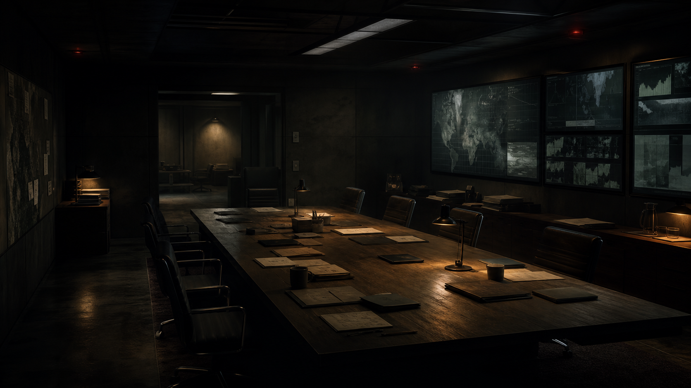

# The Crisis Room

A local-first political-military crisis simulator where incomplete information,
competing advisers, and an LLM-driven world turn every decision into a risk.
The playable scenario puts you inside U.S. EXCOMM during the Cuban Missile
Crisis.



## What You Can Do

- Question a persistent council of advisers with distinct roles and beliefs.
- Combine formal actions into a plan, preview it, then commit or reconsider.
- Open scarce backchannels and negotiate away from the public timeline.
- React to authored and generated events as pressure, credibility, and
  escalation change.
- Play in the browser or use the terminal fallback.
- Save, resume, and inspect deterministic debug state locally.

The game calls an already-running OpenAI-compatible API such as LM Studio or
llama.cpp. It never starts or stops the model server during normal gameplay.

## Requirements

- Python 3.11+
- Node.js 18+
- LM Studio, llama.cpp, or another OpenAI-compatible chat API

The current prompt and context defaults target Qwen 3.5 35B, but the endpoint,
API key, context size, and model name are configurable.

## Quick Start

```powershell
python -m venv .venv
.\.venv\Scripts\Activate.ps1
python -m pip install -e ".[dev]"
npm.cmd ci --prefix frontend
Copy-Item config/llama_cpp.example.json config/llama_cpp.local.json
```

Edit `base_url` and `server_model` in `config/llama_cpp.local.json`, start the
model API, then verify the connection:

```powershell
python main.py llm-smoke
```

Build and launch the complete browser app:

```powershell
npm.cmd run build --prefix frontend
python main.py
```

Open <http://127.0.0.1:8000>.

## Development

For live frontend reloads, run the backend and frontend in separate terminals:

```powershell
# Terminal 1
python main.py

# Terminal 2
npm.cmd run dev --prefix frontend
```

Open the Vite URL shown in Terminal 2, normally
<http://127.0.0.1:5173>. API requests are proxied to the backend on port 8000.

Run the fast automated checks with:

```powershell
python -m pytest tests -q -p no:cacheprovider
npm.cmd run build --prefix frontend
```

Current baseline: `148 passed, 4 skipped`. The skipped tests are opt-in live
LLM checks.

## Terminal Interface

```powershell
python main.py tui
```

Type `HELP` inside the TUI for the command list. Useful first moves include:

```text
ASK How do we keep an off-ramp open?
PLAN announce a quarantine, open a private Kremlin channel, and authorize recon overflights
COMMIT
BACKCHANNEL soviet_presidium Would a private non-invasion pledge make withdrawal possible?
END
```

## Configuration

`config/llama_cpp.local.json` is ignored by Git so machine-specific paths stay
local. The full set of defaults lives in
`src/crisis_room/config/settings.py`; common values can also be overridden with
the `CRISIS_ROOM_LLAMACPP_*` environment variables shown in `.env.example`.

Runtime diagnostics are written under `output/diagnostics/`, while playable
saves are written under `saves/`. Both directories are ignored by Git.

## Project Map

```text
frontend/                 React/Vite browser interface
src/crisis_room/app/      session and turn orchestration
src/crisis_room/agents/   adviser, faction, media, and game-master agents
src/crisis_room/engine/   deterministic action and adjudication mechanics
src/crisis_room/llm/      llama.cpp client, prompts, and contracts
src/crisis_room/scenario/ built-in scenario content and validation
src/crisis_room/state/    world, beliefs, events, saves, and timelines
src/crisis_room/web/      FastAPI application
tests/                    deterministic test suite
```

Architecture notes:
[system overview](architecture_diagram.md),
[LLM agent flow](LLM_AGENT_FLOW.md), and
[LLM state impact](llm_state_impact_diagram.md).
