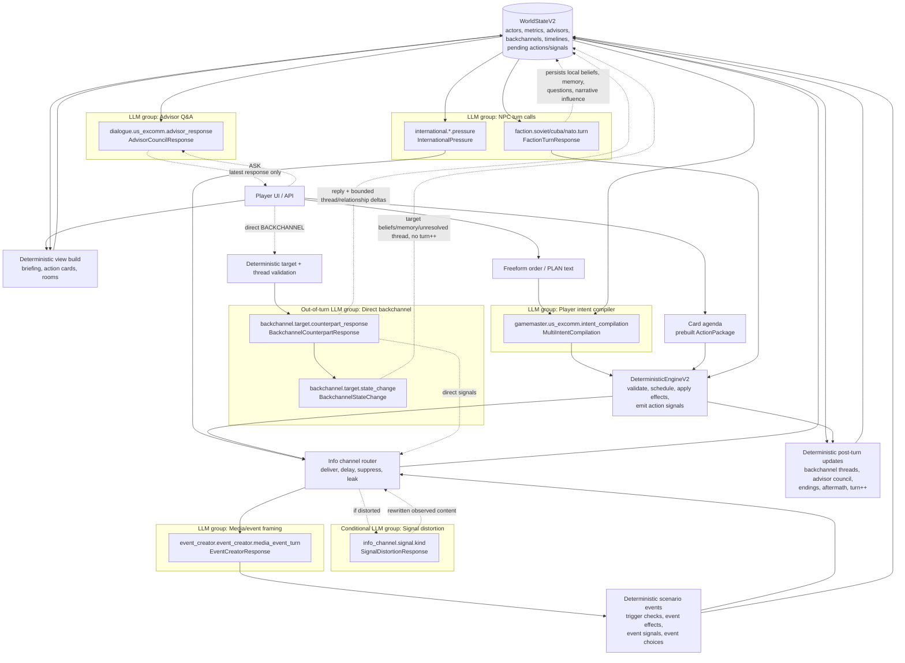

```mermaid
flowchart TD
    World[(WorldStateV2<br/>actors, metrics, advisors,<br/>backchannels, timelines,<br/>pending actions/signals)]

    UI[Player UI / API]
    View[Deterministic view build<br/>briefing, action cards, rooms]
    Agenda[Card agenda<br/>prebuilt ActionPackage]
    Freeform[Freeform order / PLAN text]

    subgraph LLM_ADVISORS["LLM group: Advisor Q&A"]
        Ask[dialogue.us_excomm.advisor_response<br/>AdvisorCouncilResponse]
    end

    subgraph LLM_GM["LLM group: Player intent compiler"]
        GM[gamemaster.us_excomm.intent_compilation<br/>MultiIntentCompilation]
    end

    subgraph LLM_NPCS["LLM group: NPC turn calls"]
        Faction[faction.soviet/cuba/nato.turn<br/>FactionTurnResponse]
        Intl[international.*.pressure<br/>InternationalPressure]
    end

    Engine[DeterministicEngineV2<br/>validate, schedule, apply effects,<br/>emit action signals]

    Router[Info channel router<br/>deliver, delay, suppress, leak]
    subgraph LLM_ROUTER["Conditional LLM group: Signal distortion"]
        Distort[info_channel.signal.kind<br/>SignalDistortionResponse]
    end

    subgraph LLM_EVENT["LLM group: Media/event framing"]
        EventCreator[event_creator.event_creator.media_event_turn<br/>EventCreatorResponse]
    end

    Events[Deterministic scenario events<br/>trigger checks, event effects,<br/>event signals, event choices]

    Post[Deterministic post-turn updates<br/>backchannel threads, advisor council,<br/>endings, aftermath, turn++]

    subgraph LLM_BACKCHANNEL["Out-of-turn LLM group: Direct backchannel"]
        Reply[backchannel.target.counterpart_response<br/>BackchannelCounterpartResponse]
        State[backchannel.target.state_change<br/>BackchannelStateChange]
    end
    Target[Deterministic target + thread validation]

    UI --> View
    View --> World
    World --> View

    UI -. ASK .-> Ask
    World --> Ask
    Ask -. latest response only .-> UI

    UI --> Agenda
    UI --> Freeform
    Freeform --> GM
    World --> GM
    GM --> Engine
    Agenda --> Engine

    World --> Faction
    World --> Intl
    Faction --> Engine
    Faction -. persists local beliefs, memory,<br/>questions, narrative influence .-> World
    Intl --> Router

    Engine --> Router
    Router -. if distorted .-> Distort
    Distort -. rewritten observed content .-> Router
    Router --> World

    Router --> EventCreator
    EventCreator --> Events
    Events --> Router
    Events --> World

    World --> Post
    Engine --> Post
    Post --> World

    UI -. direct BACKCHANNEL .-> Target
    Target --> Reply
    Reply --> State
    Reply -. reply + bounded thread/relationship deltas .-> World
    State -. target beliefs/memory/unresolved thread, no turn++ .-> World
    Reply -. direct signals .-> Router
```
