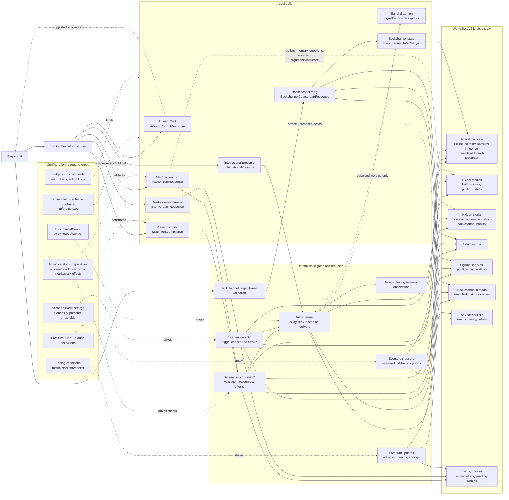

# LLM State / Knob Impact

This complements [architecture_diagram.md](architecture_diagram.md) by showing
which model calls can change which parts of `WorldStateV2`, and which settings
constrain those changes.



## State ownership

| LLM call | Direct output | State it can influence | Deterministic boundary |
| --- | --- | --- | --- |
| Advisor Q&A | Advice and proposed advisor deltas | Advisor council state | `update_advisor_council()` validates and clamps deltas |
| Player compiler | `ActionPackage` candidates | All action effects indirectly | `DeterministicEngineV2` validates and resolves them |
| NPC faction turn | Perception, memory, debate, action choice | Faction beliefs, memory, unresolved questions, narrative arguments/influence; action effects indirectly | Faction output is catalog-validated; cognitive updates remain actor-local |
| International pressure | Signal candidates | Inboxes and timelines indirectly | Signal builder and info channel validate recipients/delivery |
| Event creator | Public brief and event candidate | Public timeline; scenario events indirectly | Scenario event resolver decides whether effects fire |
| Signal distortion | Observed wording | Recipient perception only | Original signal and deterministic state remain unchanged |
| Backchannel reply | Response text and bounded hints | Thread trust/leak/relationship | Code applies bounded deltas |
| Backchannel state | Beliefs, memory, unresolved question | Target actor-local state | Code applies local updates only |

## Important ordering

```mermaid
sequenceDiagram
    participant W as WorldState
    participant G as Player compiler
    participant F as NPC faction calls
    participant E as Deterministic engine
    participant R as Info channel
    participant P as Pressure rules
    participant M as Media/event call
    participant X as Scenario events
    participant U as Post-turn updates

    W->>G: visible context
    G->>F: player package is compiled, not yet resolved
    F->>W: faction perception is persisted; faction packages collected
    F->>E: player + NPC packages
    E->>R: resolved metrics, clocks, resources, signals
    R->>P: delivered observations and routed world
    P->>M: pressure rules and hidden obligations applied
    M->>X: public brief and optional event candidate
    X->>R: fired event signals are routed
    R->>U: record missing player signals as actor-local posture evidence
    U->>W: choices, advisors, threads, endings, next-turn state
```

The faction LLM sees its persisted beliefs, memory, unresolved questions, and
narrative state on the next turn. If no player signal reached it, it also sees a
local observation that the absence could mean restraint, indecision,
concealment, or weakness. The existing faction call interprets that evidence;
no extra LLM call was added. Omniscient truth metrics and hidden clocks remain
deterministic and reach factions only through visible evidence.
